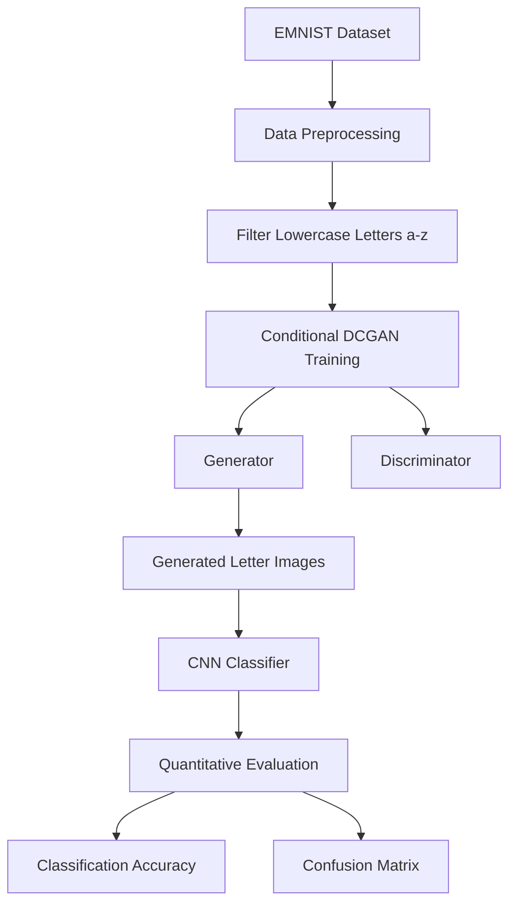
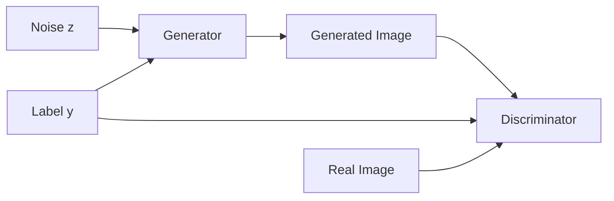
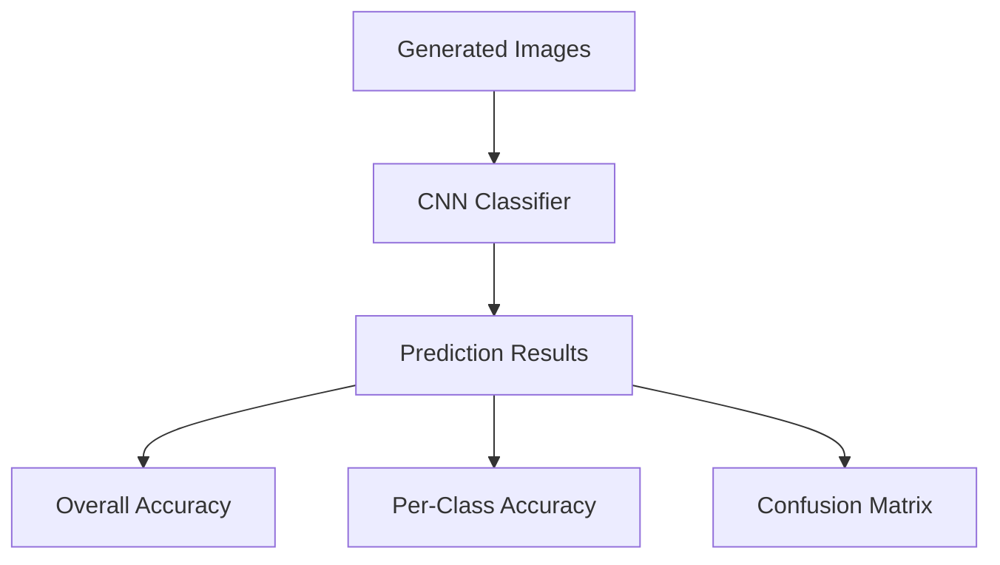
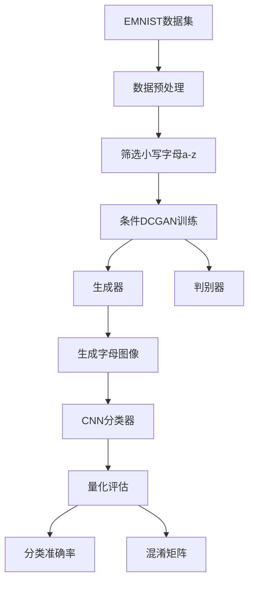
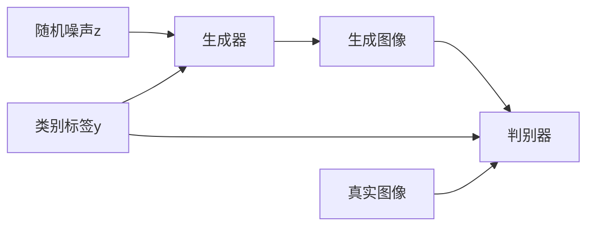
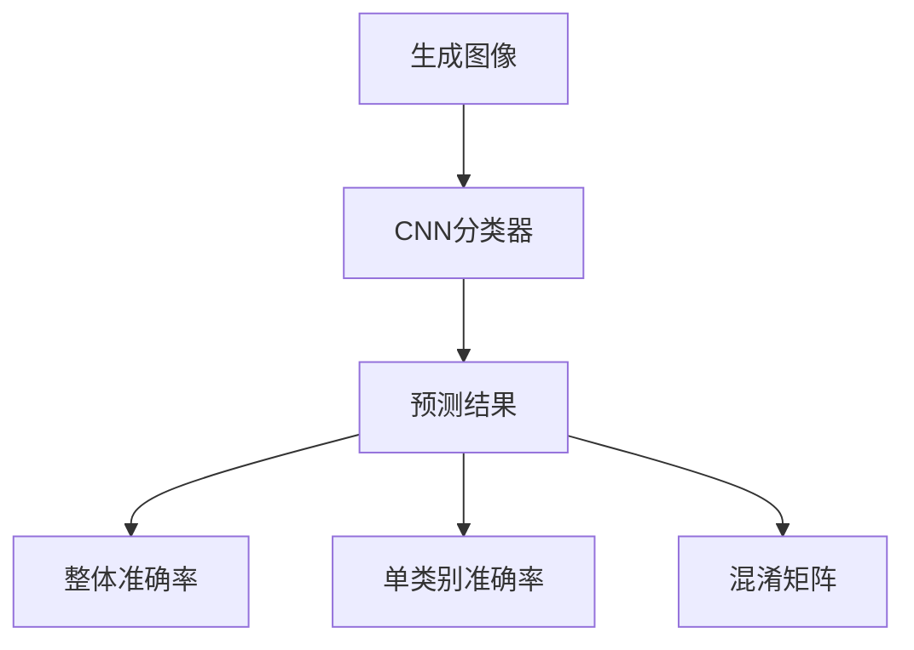

# EMNIST a-z Conditional DCGAN Based on MindSpore

Conditional DCGAN implementation based on MindSpore for generating handwritten lowercase English letters (`a-z`) using the EMNIST dataset.

This project provides a complete pipeline including:

- EMNIST automatic downloading and preprocessing
- Conditional DCGAN training
- Batch handwritten letter generation
- CNN classifier training
- Quantitative evaluation of generated samples

---

# Overview

## Framework Pipeline



---

# Project Structure

```plaintext
EMNIST-cDCGAN-MindSpore/
│
├── datasets/
│   ├── emnist/raw/              # Original EMNIST dataset
│   └── generate/                # Generated a-z image dataset
│
├── outputs/
│   ├── models/                  # Generator & discriminator checkpoints
│   └── epoch_*.png              # Per-epoch generated results
│
├── infer/
│   ├── emnist_classifier_2.ckpt # CNN classifier weights
│   ├── train_state_2.npz        # Resume training state
│   ├── train_curve_2.png        # Loss & accuracy curves
│   └── eval_result/             # Evaluation outputs
│
├── cDCGAN_train.py              # Train conditional DCGAN
├── cDCGAN_generate.py           # Batch image generation
├── train_classifier.py          # Train CNN classifier
├── evaluate_generated.py        # Evaluate generated samples
│
├── requirements.txt
└── README.md
```

---

# Features

- Full closed-loop workflow

```text
Download → Train → Generate → Classify → Evaluate
```

- Automatic EMNIST downloading
- Conditional generation for all lowercase letters (`a-z`)
- Relative-path project design
- Resume checkpoint training
- Automatic EMNIST orientation correction
- Quantitative evaluation using CNN classifier
- Confusion matrix visualization
- Training curve visualization

---

# Environment Requirements

## Dependencies

```plaintext
mindspore
numpy
matplotlib
tqdm
Pillow
requests
```

## Installation

```bash
pip install -r requirements.txt
```

---

# Dataset Processing

The project automatically downloads and preprocesses the EMNIST dataset.

## Dataset Workflow


Only lowercase English letters (`a-z`) are retained for training.

---

# Conditional DCGAN Architecture

## Generator Input

```text
Noise Vector z + Letter Label
```

## Discriminator Input

```text
Image + Letter Label
```

## GAN Training Process



---

# Quick Start

## 1. Train Conditional DCGAN

```bash
python cDCGAN_train.py
```

### Outputs

```plaintext
outputs/models/
outputs/epoch_*.png
```

Functions:

- Automatic dataset download
- Resume training support
- Generator/discriminator checkpoint saving
- Epoch visualization saving

---

## 2. Generate Handwritten Letters

```bash
python cDCGAN_generate.py
```

Generated images are automatically rotated and flipped to match the original EMNIST orientation.

### Output Directory

```plaintext
datasets/generate/
```

---

## 3. Train CNN Classifier

```bash
python train_classifier.py
```

Functions:

- Resume training
- Gradient clipping
- Early stopping
- Training curve saving

### Outputs

```plaintext
infer/emnist_classifier_2.ckpt
infer/train_curve_2.png
```

---

## 4. Evaluate Generated Samples

```bash
python evaluate_generated.py
```

### Evaluation Outputs

```plaintext
class_accuracy.txt
confusion_matrix.csv
confusion_matrix.png
```

---

# Evaluation Pipeline



---

# Quantitative Metrics

| Metric | Description |
|---|---|
| Overall Accuracy | Recognition accuracy of generated samples |
| Per-Class Accuracy | Accuracy for each lowercase letter |
| Confusion Matrix | Detailed classification distribution |

---

# Technical Details

| Item | Value |
|---|---|
| Framework | MindSpore |
| GAN Type | Conditional DCGAN |
| Dataset | EMNIST Lowercase |
| Image Size | 28 × 28 |
| Image Type | Grayscale |
| Number of Classes | 26 |
| Character Set | a-z |

---

# Future Improvements

Possible future extensions include:

- WGAN-GP architecture
- StyleGAN-based generation
- Diffusion model generation
- FID / IS quantitative metrics
- Interactive GUI handwriting system
- Real-time handwritten recognition

---

# License

This project is intended for educational and research purposes only.

---

# 中文说明

基于 MindSpore 的条件 DCGAN 项目，用于生成 EMNIST 数据集中的小写英文字母（a-z）。

本项目实现了完整闭环流程，包括：

- EMNIST 数据集自动下载与预处理
- 条件 DCGAN 训练
- 批量手写字母生成
- CNN 分类器训练
- 生成样本量化评估

---

# 项目流程

## 整体框架



---

# 项目特点

- 完整闭环流程

```text
数据下载 → GAN训练 → 图像生成 → 分类训练 → 量化评估
```

- 自动下载 EMNIST 数据集
- 支持 26 个小写字母条件生成
- 全部采用相对路径
- 支持断点续训
- 自动修正 EMNIST 图像方向
- 提供 CNN 定量评估
- 支持混淆矩阵可视化
- 支持训练曲线保存

---

# 环境依赖

## 安装依赖

```bash
pip install -r requirements.txt
```

---

# 数据集处理流程


仅保留小写英文字母 `a-z` 用于训练。

---

# 条件 DCGAN 结构

## 生成器输入

```text
随机噪声 z + 字母标签
```

## 判别器输入

```text
图像 + 标签
```

## GAN 训练流程



---

# 快速开始

## 1. 训练条件 DCGAN

```bash
python cDCGAN_train.py
```

功能：

- 自动下载数据集
- 支持断点续训
- 自动保存模型权重
- 自动保存每轮生成效果图

---

## 2. 批量生成字母图像

```bash
python cDCGAN_generate.py
```

功能：

- 批量生成 a-z 字母图像
- 自动旋转与镜像修正
- 对齐真实 EMNIST 字符方向

---

## 3. 训练 CNN 分类器

```bash
python train_classifier.py
```

功能：

- 支持断点续训
- 梯度裁剪
- Early Stopping
- 自动保存训练曲线

---

## 4. 量化评估生成结果

```bash
python evaluate_generated.py
```

输出：

```plaintext
class_accuracy.txt
confusion_matrix.csv
confusion_matrix.png
```

---

# 评估流程



---

# 技术参数

| 项目 | 内容 |
|---|---|
| 深度学习框架 | MindSpore |
| GAN类型 | Conditional DCGAN |
| 数据集 | EMNIST Lowercase |
| 图像尺寸 | 28 × 28 |
| 图像类型 | 灰度图 |
| 类别数量 | 26 |
| 字符范围 | a-z |

---

# 后续改进方向

未来可扩展：

- WGAN-GP
- StyleGAN
- Diffusion Model
- FID / IS 指标
- GUI 手写识别系统
- 实时交互式绘图识别

---

# License

本项目仅用于学习与科研用途。